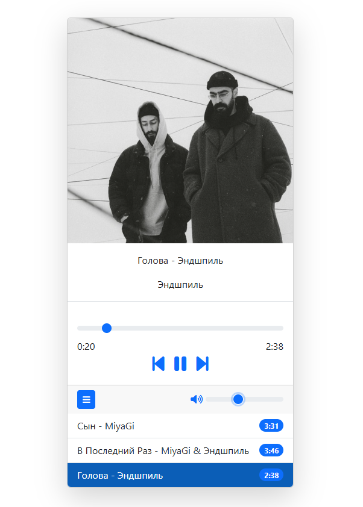

# 🎵 MP3 Çalar Web Uygulaması

Bu proje basit bir MP3 çalar uygulamasıdır. Kullanıcı arayüzü HTML ve CSS ile oluşturulmuştur, müzik oynatma işlemleri JavaScript ile sağlanmaktadır.

## 🔧 Kullanılan Teknolojiler

- HTML5
- CSS3 (bootstrap)
- JavaScript (Ses kontrolü ve oynatma)

## 🎯 Özellikler

- Play (Oynat) ve Pause (Duraklat) butonları
- Şarkı ismini ve süresini gösterme
- Responsive tasarım (mobil uyumlu)

## 🖼️ Görseller

🔗 **Canlı Demo:**  
👉 [Siteyi Görüntüle](https://682b29c402a6a03291a94d18--cerulean-crisp-a46d28.netlify.app/)
